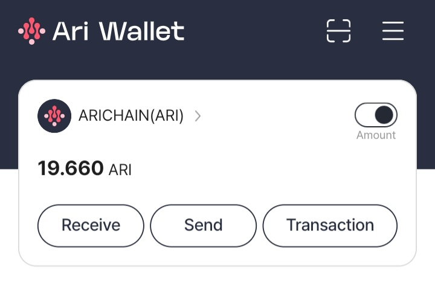

## ARI CHAIN WALLET AUTO REFERRAL BOT

This bot automates the process of creating accounts and using referral codes for the AriChain Wallet.



## BOT FEATURE

- Automatically generates random email addresses.
- Uses proxies to avoid IP bans.
- Logs the created accounts.
- Handles email verification.

## PREREQUISITE

- Node.js 18 v18.20.5 LTS or latest.
- npm (Node Package Manager)
- Use 2Captcha Services [2Captcha](https://2captcha.com/), free version you can using gemini apikey.

## SETUP & CONFIGURE BOT

1. Clone the repository:

   ```sh
   git clone https://github.com/Rambeboy/arichain-wallet-autoreff.git && cd arichain-wallet-autoreff
   ```

2. Install the dependencies:

   ```sh
   npm install
   ```

3. Create a `proxy.txt` file in the root directory and add your proxies (one per line)
   ```sh
   nano proxy.txt
   ```

4. Change `client_secret.json.example` to `client_secret.json`.

5. Set up Gmail API credentials:

- Go to the [Google Cloud Console](https://console.developers.google.com/).
- Create a new project.
- Enable the Gmail API for the project.
- Create OAuth 2.0 credentials for a native application.
- Download the `client_secret.json` open it and copy paste to `src/json/client_secret.json`.
- Don't forget to change the email referral verification in `client_secret.json`.
- Change gemini apikey in `client_secret.json`.

6. If you want using 2 Captcha service you can fill your apikey in `client_secret.json` and change `"captha2Apikey": "your_2captcha_apikey",` with your apikey.

Get gemini apikey : [Here](https://aistudio.google.com/app/apikey)

## USAGE

1. Run the bot:

   ```sh
   npm run start
   ```

2. Follow the prompts to enter your referral code, address to transfer token and the number of accounts you want to create, and dont forget too choice your solve captcha too.

3. If this is your first time running the bot, you will be prompted to authorize the application to access your Gmail account. Follow the instructions to complete the authorization.

## OUTPUT

- The created accounts will be saved in `accounts.txt`.

## NOTES

- If you get error `invalid creds` you can delete token in `src/json/token.json`
- Make sure to use valid proxies to avoid IP bans.
- The bot will attempt to verify the email up to 5 times before giving up.

## LICENSE

This project is licensed under the MIT License. See the [LICENSE](LICENSE) file for more details.

## DISCLAIMER

This tool is for educational purposes only. Use it at your own risk.
